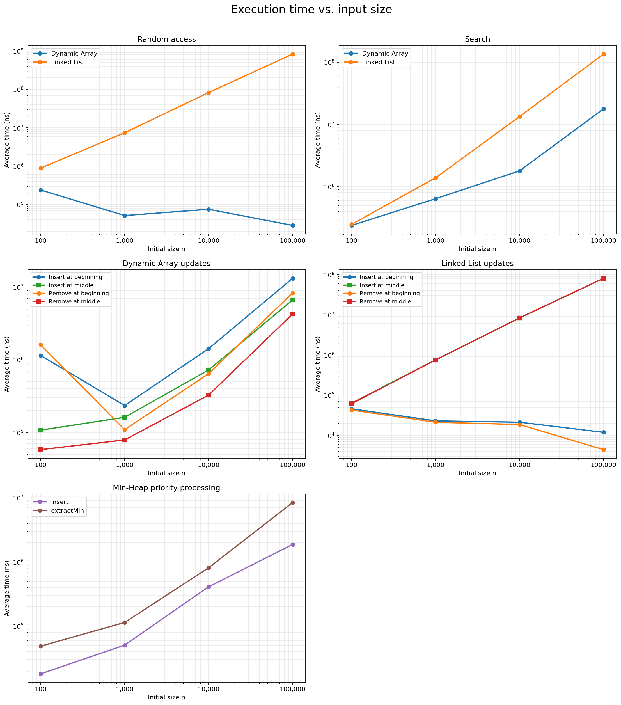
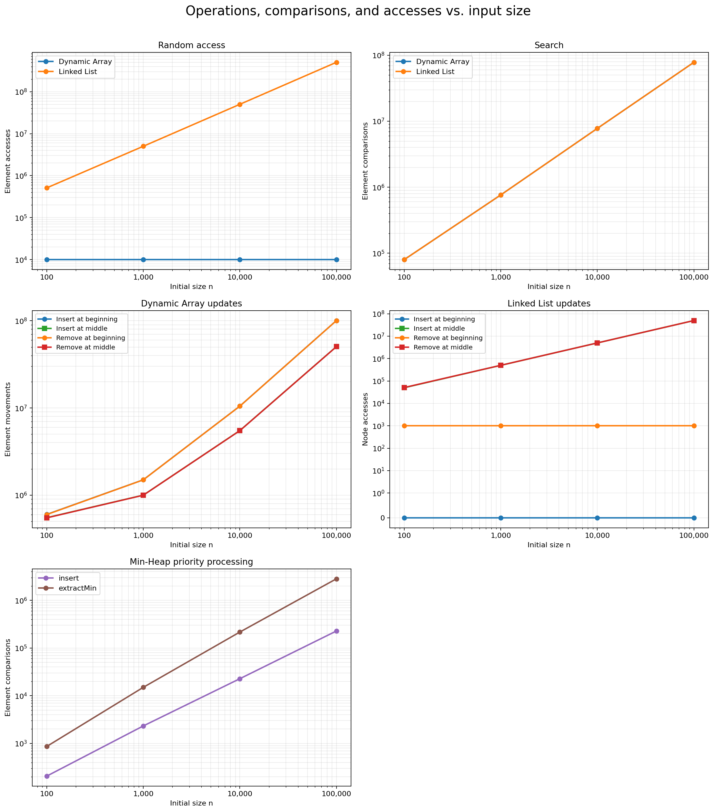

# Assignment 2: algorithmic analysis

## 1. Overview

This project implements a dynamic array, a singly linked list, and a min-heap without using Java collection classes for their internal storage. Each structure records the accesses, comparisons, or movements needed by the benchmark workloads. The project compares theoretical complexity with timings collected from fixed workloads at several input sizes.

The source files also include a correctness test suite and a benchmark runner. Java's standard collections are used only in the tests as reference implementations.

### Running the project

Compile the Java files and run the tests:

```bash
javac -d out src/*.java
java -cp out Tests
```

Run the benchmarks from the project root:

```bash
java -cp out Benchmark
```

The benchmark command replaces the CSV files in `results/tables`. Plot generation requires Python and Matplotlib:

```bash
python3 -m pip install matplotlib
python3 results/plots/generate_plots.py
```

## 2. Complexity analysis

In the tables, `n` is the number of stored elements. Ω gives a lower bound, O gives an upper bound, and Θ gives a tight bound. Average cases assume typical valid indices and search values. Space refers to temporary auxiliary space used by one operation.

### Dynamic Array

| Operation | Best case | Average case | Worst case | Auxiliary space |
| --- | --- | --- | --- | --- |
| `add(x)` | Ω(1) | Θ(1) amortized | O(n) | O(n) during resize |
| `add(index, x)` | Ω(1) | Θ(n) | O(n) | O(n) during resize |
| `remove(index)` | Ω(1) | Θ(n) | O(n) | Θ(1) |
| `get(index)` | Ω(1) | Θ(1) | O(1) | Θ(1) |
| `contains(x)` | Ω(1) | Θ(n) | O(n) | Θ(1) |

`get` uses the index as an array offset, so its running time does not grow with `n`. Appending is usually constant time. When the internal array is full, `add(x)` allocates a larger array and copies all existing values, which makes that individual call linear. Doubling the capacity spreads this copying cost across many appends and gives an amortized Θ(1) average.

Indexed insertion shifts every value from the insertion point to the right. Removal shifts the remaining values to the left. An operation near the end may move few or no values, while an operation near the beginning moves close to `n` values. Search checks values in order and may stop at the first element, but a missing value requires `n` comparisons.

### Linked List

| Operation | Best case | Average case | Worst case | Auxiliary space |
| --- | --- | --- | --- | --- |
| `add(x)` | Ω(1) | Θ(1) | O(1) | Θ(1) |
| `add(index, x)` | Ω(1) | Θ(n) | O(n) | Θ(1) |
| `remove(index)` | Ω(1) | Θ(n) | O(n) | Θ(1) |
| `get(index)` | Ω(1) | Θ(n) | O(n) | Θ(1) |
| `contains(x)` | Ω(1) | Θ(n) | O(n) | Θ(1) |

The list keeps both `head` and `tail` references, so `add(x)` appends a node in constant time. Insertion at index 0 is also constant because only the head link changes. An insertion in the middle must first traverse to the previous node. The same traversal cost applies to indexed removal and access. Search follows one link at a time until it finds the value or reaches the end.

The list can insert or remove at the beginning without shifting stored values. The dynamic array has faster indexed access because its elements occupy consecutive positions. These operations can have different practical times even when they share the same O(n) upper bound because array copying and node traversal use memory differently.

### Min-Heap

| Operation | Best case | Average case | Worst case | Auxiliary space |
| --- | --- | --- | --- | --- |
| `insert(x)` | Ω(1) | Θ(log n) | O(n) when resized | O(n) during resize |
| `peekMin()` | Ω(1) | Θ(1) | O(1) | Θ(1) |
| `extractMin()` | Ω(1) | Θ(log n) | O(log n) | Θ(1) |

The minimum is always stored at index 0, so `peekMin()` is constant time. Insertion adds a value at the end and may move it toward the root. Extraction replaces the root with the last value and may move that value toward a leaf. A binary heap has height Θ(log n), which bounds both loops. An insertion without resizing is O(log n). A resize copies `n` values, so one insertion can take O(n) time and O(n) temporary space.

## 3. Correctness

### Loop invariant for `DynamicArray.add(index, value)`

Let `oldSize` be the number of elements before insertion. The shifting loop starts with `i = oldSize` and moves toward `index`.

Loop invariant: before an iteration with the current value of `i`, every original element from position `i` through `oldSize - 1` is already stored one position to the right. The original elements from `index` through `i - 1` are still in their old positions. Elements before `index` have not changed.

Initialization. Before the first iteration, `i` equals `oldSize`. The range from `oldSize` through `oldSize - 1` is empty, so there are no shifted elements to check. All existing elements are still in their original positions. `ensureCapacity()` has already made position `oldSize` available and preserves the order of existing values if a resize occurs.

Maintenance. The loop assigns `arr[i] = arr[i - 1]`. This moves the original element at `i - 1` one position to the right. After `i` is decreased, the shifted range begins at the new value of `i`, and all positions before it remain unchanged. The invariant therefore holds for the next iteration.

Termination. The loop stops when `i == index`. At that point, every original element from `index` through `oldSize - 1` has moved to the position one place to its right. Position `index` is free, while every element before it is unchanged.

The method writes the new value at `index` and increases `size`. The resulting array contains the old prefix, the inserted value, and the shifted suffix in their required order. This proves that indexed insertion is correct.

### Loop invariant for `MinHeap.insert(value)`

The method places the new value at the next free position and calls the upward loop with `currentIndex` at that position.

Loop invariant: before each iteration, the min-heap property holds for every parent-child edge except possibly the edge between `currentIndex` and its parent. All subtrees below `currentIndex` are valid min-heaps, and the array still contains exactly the old heap elements plus the inserted value.

Initialization. The old array already satisfies the min-heap property. The new value is added as a leaf, so it has no children. Adding a leaf cannot change any existing parent-child relationship. The only possible violation is between the new leaf and its parent, which matches the invariant.

Maintenance. If the parent is less than or equal to the current value, the possible violation is gone and the loop stops. Otherwise, the method swaps the current value with its parent. The smaller inserted value moves upward. The former parent moves down to a position where it remains no greater than the existing children, since those relationships came from the valid heap before the swap. The only edge that may now violate the property is between the inserted value at its new position and its new parent. The invariant holds again.

Termination. The loop ends when the inserted value reaches the root or its parent is less than or equal to it. The invariant says that every other edge is already valid, and the stopping condition makes the last possible edge valid as well.

No values are lost during the swaps, and every parent is less than or equal to its children when the loop ends. The array therefore represents a valid min-heap containing the inserted value.

## 4. Experimental setup

The experiments use `n = 100`, `1,000`, `10,000`, and `100,000`. Each measured case runs five times, and the tables report the arithmetic mean. Timing uses `System.nanoTime()`. Input arrays, random indices, search values, and structures are prepared before the timed section. No printing or file writing occurs while an operation is being measured.

The stored values and indices use the fixed seed 42. Search queries use the fixed seed 43 so that they do not repeat the beginning of the stored-value sequence. Every repetition for a given `n` receives the same inputs. The recorded results were produced with OpenJDK 26.0.2.1 on Darwin arm64.

The workloads use these operation counts:

| Workload | Structures | Operations measured |
| --- | --- | --- |
| Random access | Dynamic Array, Linked List | `m = 10,000` calls to `get(index)` |
| Search | Dynamic Array, Linked List | `m = 1,000` calls to `contains(value)` |
| Insertion and removal | Dynamic Array, Linked List | `m = 1,000` operations at index 0 or `n / 2` |
| Priority processing | Min-Heap | `n` insertions followed by `n` extractions |

The removal workload needs 1,000 valid removals even when `n = 100`. Its untimed setup starts with the original `n` values and inserts 1,000 temporary values at the tested index. The timed section removes those temporary values, leaving the original structure. This keeps the measured removal count at 1,000 for every input size.

Random access records element accesses. Search and heap workloads record comparisons. The update workload records array movements or linked-list node accesses. Heap validity and non-decreasing extraction order are checked after the timed work.

## 5. Results

Times below are averages in milliseconds. The CSV files in [`results/tables`](results/tables) keep the original nanosecond measurements.

### Workload 1: random access

| n | Dynamic Array time | Linked List time | Dynamic Array accesses | Linked List accesses |
| ---: | ---: | ---: | ---: | ---: |
| 100 | 0.240 | 0.888 | 10,000 | 511,508 |
| 1,000 | 0.052 | 7.433 | 10,000 | 5,015,208 |
| 10,000 | 0.076 | 82.384 | 10,000 | 50,139,208 |
| 100,000 | 0.029 | 827.894 | 10,000 | 502,499,208 |

The array performs one access for each request, independent of `n`. The list must walk from the head to every requested index, so its access count and running time grow with `n`.

### Workload 2: search

| n | Dynamic Array time | Linked List time | Dynamic Array comparisons | Linked List comparisons |
| ---: | ---: | ---: | ---: | ---: |
| 100 | 0.237 | 0.247 | 79,905 | 79,905 |
| 1,000 | 0.638 | 1.383 | 764,533 | 764,533 |
| 10,000 | 1.790 | 13.370 | 7,795,097 | 7,795,097 |
| 100,000 | 17.805 | 135.255 | 78,291,372 | 78,291,372 |

Both implementations make the same number of value comparisons because they examine values in the same order. The linked list takes longer as `n` grows because following node references has a higher practical cost than reading consecutive array positions.

### Workload 3: insertion and removal

Each cell shows average time in milliseconds followed by the movement or access count in parentheses.

Dynamic Array results:

| n | Insert beginning | Remove beginning | Insert middle | Remove middle |
| ---: | ---: | ---: | ---: | ---: |
| 100 | 1.146 (602,000) | 1.609 (599,500) | 0.108 (552,000) | 0.058 (549,500) |
| 1,000 | 0.235 (1,501,500) | 0.109 (1,499,500) | 0.162 (1,001,500) | 0.079 (999,500) |
| 10,000 | 1.422 (10,510,500) | 0.644 (10,499,500) | 0.725 (5,510,500) | 0.327 (5,499,500) |
| 100,000 | 13.175 (100,600,500) | 8.292 (100,499,500) | 6.648 (50,600,500) | 4.264 (50,499,500) |

Linked List results:

| n | Insert beginning | Remove beginning | Insert middle | Remove middle |
| ---: | ---: | ---: | ---: | ---: |
| 100 | 0.046 (0) | 0.043 (1,000) | 0.063 (50,000) | 0.061 (51,000) |
| 1,000 | 0.023 (0) | 0.021 (1,000) | 0.756 (500,000) | 0.752 (501,000) |
| 10,000 | 0.021 (0) | 0.019 (1,000) | 8.313 (5,000,000) | 8.384 (5,001,000) |
| 100,000 | 0.012 (0) | 0.004 (1,000) | 80.859 (50,000,000) | 80.946 (50,001,000) |

Beginning updates in the linked list change the head reference and do not traverse the existing list. Middle updates traverse about half of the nodes for each operation. The array shifts about twice as many elements at the beginning as it does in the middle when `n` is large.

### Workload 4: priority processing

| n | Insert time | Insert comparisons | Extract time | Extract comparisons |
| ---: | ---: | ---: | ---: | ---: |
| 100 | 0.018 | 206 | 0.049 | 863 |
| 1,000 | 0.051 | 2,326 | 0.114 | 14,996 |
| 10,000 | 0.410 | 22,753 | 0.810 | 216,531 |
| 100,000 | 1.868 | 227,857 | 8.431 | 2,831,426 |

All extracted values were in non-decreasing order. Extraction made more comparisons than insertion because each removed root may travel through several heap levels. `peekMin()` was not timed as a separate workload because it reads index 0 directly and is Θ(1).

### Plots





## 6. Discussion

Increasing `n` had little effect on the Dynamic Array random-access operation count, while Linked List access counts grew in direct proportion to `n`. Search comparisons also grew with `n` for both structures. Update results depended on position: list operations at the beginning stayed constant, middle list operations grew linearly, and array updates grew with the number of shifted elements. Heap insertion and extraction times increased with the number of processed values.

The operation counts agree with the theoretical analysis. Dynamic Array `get` remained Θ(1) per call. Linked List `get`, both `contains` methods, array shifting, and middle list traversal showed linear growth. Heap extraction comparisons followed the expected `n log n` pattern for processing all elements. Heap insertion used about 2.3 comparisons per inserted random value in these runs, so its measured comparison count was close to linear even though one insertion has an O(log n) upper bound.

Some timing rows do not increase smoothly. Dynamic Array random access was slower at `n = 100` than at the larger sizes, and the small update cases also fluctuate. The JVM compiles frequently executed methods while the program is running, and the benchmark does not include a separate warm-up phase. Timer resolution, cache state, allocation, and background system activity matter more when a measured section lasts only a fraction of a millisecond. The operation counters are deterministic and show the growth pattern more clearly in these cases.

The search workload shows why equal Big-O complexity does not guarantee equal time. Both structures made identical comparison counts, but the array was much faster at large `n`. Its values are stored next to each other in memory, while the list follows references between separate node objects. Cache behavior, bounds checks, branches, resizing, and object allocation all contribute constant costs that asymptotic notation leaves out.

## 7. Design recommendations

The Dynamic Array is the better choice when a workload performs frequent indexed reads or scans. It also works well for appending because capacity doubling makes the average append constant time. Insertions and removals near the beginning are costly because they shift many elements.

The Linked List is useful when operations occur at the beginning or when sequential traversal is acceptable. This implementation is a poor choice for repeated random access or middle updates because each operation starts traversal from the head.

The Min-Heap fits priority processing because the smallest value is always available at the root. It provides constant-time minimum lookup and logarithmic insertion and extraction loops without keeping the entire collection fully sorted.

The expected workload should decide the structure. Indexed reads favor the Dynamic Array, beginning updates favor the Linked List, and repeated minimum removal favors the Min-Heap. The measured results support these choices even where short timings contain JVM noise.

## 8. Conclusion

The experiments matched the main theoretical growth rates. Contiguous array storage gave stable random access and faster scans, linked nodes made beginning updates cheap but indexed traversal expensive, and the heap maintained priority order with logarithmic adjustment paths. The counters explained the trends more consistently than very short timing measurements, so both measurements are needed when comparing the implementations.
